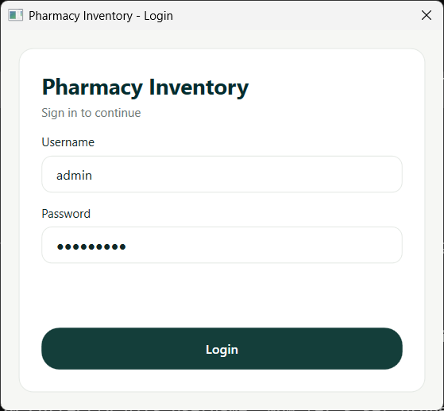
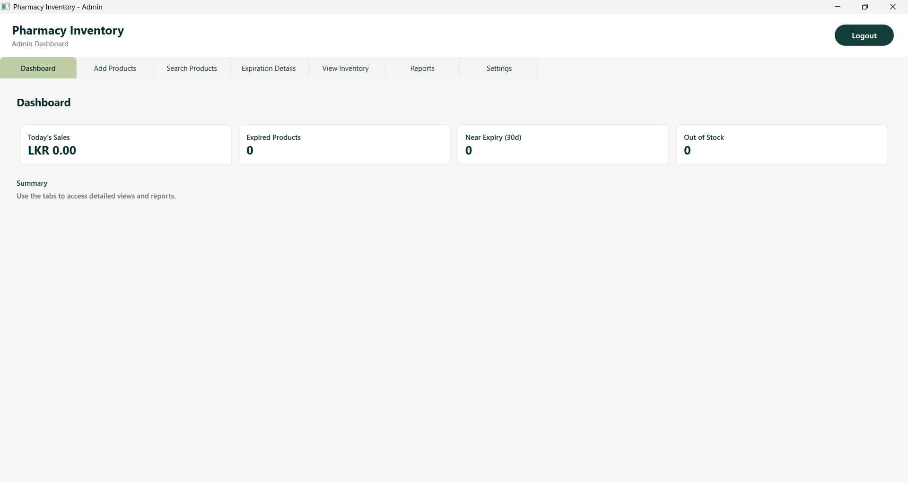
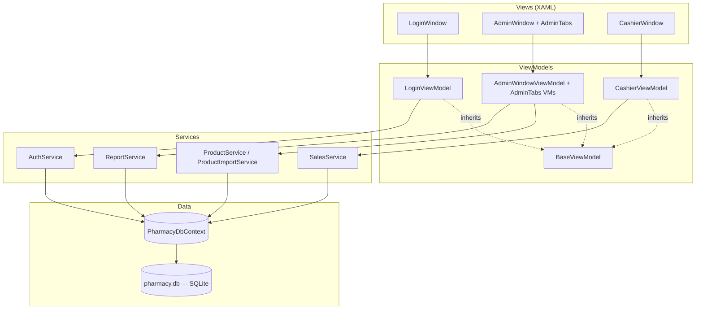

<div align="center">

# 💊 Pharmly — Pharmacy Inventory Management

**A compact, modern WPF desktop application for managing pharmacy inventory, sales and reporting.**

[](https://dotnet.microsoft.com/)
[](https://learn.microsoft.com/dotnet/csharp/)
[](https://learn.microsoft.com/dotnet/desktop/wpf/)
[](https://learn.microsoft.com/ef/core/)
[](https://www.sqlite.org/)
[](https://github.com/ClosedXML/ClosedXML)
[](#getting-started)
[](#license)

</div>

---

## Table of contents
- [Overview](#overview)
- [Screenshots](#screenshots)
- [Features](#features)
- [Tech stack](#tech-stack)
- [Architecture](#architecture)
- [Getting started](#getting-started)
- [Development](#development)
- [Database & migrations](#database--migrations)
- [Packaging & client delivery](#packaging--client-delivery)
- [Recommended Git workflow](#recommended-git-workflow)
- [Contributing](#contributing)
- [License](#license)

---

## Overview

Pharmly is a role-based desktop point-of-sale and inventory system for small pharmacies. It follows the **MVVM** pattern end to end, persists to a local **SQLite** database via **EF Core**, and ships as a self-contained Windows desktop app — no server, no internet connection required.

## Screenshots

<div align="center">

| Login | Admin dashboard |
|:---:|:---:|
|  |  |
| Role-aware sign-in for Admin / Cashier | Live stats: sales, expired stock, near-expiry, out-of-stock |

</div>

## Features

| Area | Capability |
|---|---|
| 🔐 **Auth** | Role-based login (Admin / Cashier) with salted PBKDF2 password hashing |
| 📦 **Inventory** | Add, search and browse products — medicine and grocery item types |
| ⏳ **Expiry tracking** | Dashboard widgets and a dedicated tab for near-expiry / expired stock |
| 🧾 **Sales (Cashier)** | Cart-based checkout flow with receipts |
| 📊 **Reporting** | Built-in reports with Excel export via ClosedXML |
| 👤 **User management** | Admin settings tab to add/deactivate users |
| 🎨 **Theming** | Custom modern theme (`Themes/PharmlyTheme.xaml`) |
| 📀 **Offline-first** | Single-file SQLite database, migrations applied automatically on startup |

## Tech stack

<div align="center">

| Layer | Technology |
|---|---|
| UI | WPF (.NET 8, `net8.0-windows`) |
| Pattern | MVVM — `RelayCommand` / `AsyncRelayCommand`, `BaseViewModel` (`INotifyPropertyChanged`) |
| Data access | Entity Framework Core 8 + SQLite |
| Dependency injection | `Microsoft.Extensions.Hosting` generic host |
| Reporting/export | ClosedXML (Excel) |
| Password hashing | PBKDF2-HMAC-SHA256 (`Rfc2898DeriveBytes`), per-user salt |

</div>

## Architecture

MVVM layering, top to bottom:



`App.xaml.cs` wires everything through a generic `IHost`, applies pending EF Core migrations on startup, and shows the `LoginWindow`. Based on the authenticated user's role, the app opens either `AdminWindow` (with its tabbed sub-views) or `CashierWindow`.

## Getting started

Prerequisites

- Windows 10 or later
- [.NET 8 SDK](https://dotnet.microsoft.com/)
- (Optional) Visual Studio 2022/2023 for debugging and designer support

Clone and open the solution or run from the command line:

```powershell
git clone <your-repo-url>
cd "PharmacyInventory"
dotnet build
dotnet run --project PharmacyInventory.csproj
```

Or open `PharmacyInventory.sln` in Visual Studio and run the project.

**Default sign-in credentials** (seeded on first run):

| Role | Username | Password |
|---|---|---|
| Admin | `admin` | `admin@123` |
| Cashier | `cashier` | `pass@123` |

## Development

- The application follows MVVM. ViewModels are under `ViewModels/`, views under `Views/` and services under `Services/`.
- UI styling is in `Themes/PharmlyTheme.xaml`.
- Use the `Host` configuration in `App.xaml.cs` to register services and the DbContext.

Useful commands

```powershell
# build
dotnet build
# run
dotnet run --project PharmacyInventory.csproj
# run tests (if added later)
dotnet test
```

## Database & migrations

- The app uses SQLite. At runtime it expects a `pharmacy.db` file in the app working directory.
- `Migrations/` contains EF migrations; the app applies pending migrations on startup (`App.xaml.cs`, `Database.MigrateAsync()`).
- The DB file is excluded from source control. Do not commit `pharmacy.db`.

To create or update migrations locally:

```powershell
dotnet tool install --global dotnet-ef   # once per machine
dotnet ef migrations add <MigrationName> --project PharmacyInventory.csproj
dotnet ef database update --project PharmacyInventory.csproj
```

> **Gotcha:** every EF Core migration needs a matching `<Migration>.Designer.cs` file — that's where the `[Migration("id")]` attribute lives. Without it, EF Core silently ignores the migration and it never gets applied. Always scaffold migrations with `dotnet ef migrations add`, never by hand-copying a `.cs` file.
>
> Also note: the seeded `admin` / `cashier` password hashes in `PharmacyDbContext.OnModelCreating` are pinned as **literal strings**, not a live `PasswordHasher.Hash(...)` call — hashing uses a random salt, so calling it at model-build time would make EF regenerate a "changed" seed on every migration scaffold.

## Packaging & client delivery

Use the included `PrepareClientDelivery.ps1` to produce a publishable delivery folder without the database file.

```powershell
# run the packaging script from project root
./PrepareClientDelivery.ps1
```

The script produces `PharmacyInventory_ClientDelivery` on your Desktop (see script for options such as runtime identifier and single-file publish).

## Recommended Git workflow

- Keep commits small and focused. Suggested logical groups:
  - `ui: add theme and views`
  - `data: models, DbContext, migrations`
  - `feat(services): business logic services`
  - `feat(viewmodels): screens and bindings`
  - `chore: scripts, tooling`

```powershell
git remote add origin https://github.com/Dula0268/pharmacy-inventory-management.git
git branch -M main
git push -u origin main
```

## Contributing

- Open issues for bugs and feature requests.
- Send pull requests against the `main` branch.
- Include descriptive commit messages and follow the commit grouping above.

## License

No `LICENSE` file is present in this repository yet. Contact the project owner for clarification on usage terms.

---

<div align="center">

For questions or help, open an issue on the repository or contact the maintainer.

</div>
